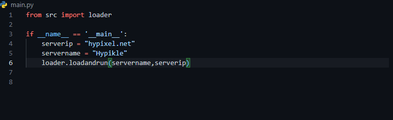
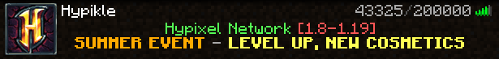

# MinecraftIpToGuiImage
Give it a valid, online, Minecraft server ip, and the program shall return an image of the server as if its a screenshot taken in Minecraft

# How does it work?
Basically, using the [Minecraft Server Status API](https://api.mcsrvstat.us), and its icon endpoint, the program gets the required information it needs to create an image, which looks as if it was a screenshot of the server menu taken inside Minecraft.

# How to run it?
Prerequisites:
- Python 3+
- Three python libraries, `Pillow`, `BeautifulSoup`, and 'Requests'.

To install the libraries, go to the command line and type

Pillow:
```shell
python3 -m pip install --upgrade Pillow
```

BeautifulSoup:
```shell
python3 -m pip install --upgrade BeautifulSoup4
```

Requests:
```shell
python3 -m pip install --upgrade requests
```

If an error occurs, use google


To run it:
- Go inside the main.py file
- Change the content inside the `serverip` and `servername` to your choice. Then save the file.
- Go to the command line and navigate it to the folder in which main.py is in
- Do 
```shell
python3 main.py
```
- Wait a few seconds. An image should pop up, showing the rendered image. It is also saved to a file called `output.png`.


# Example
Here i am putting the server ip as `hypixel.net`, and setting the server name as `Hypikle`


Here is the ouput after running the file


